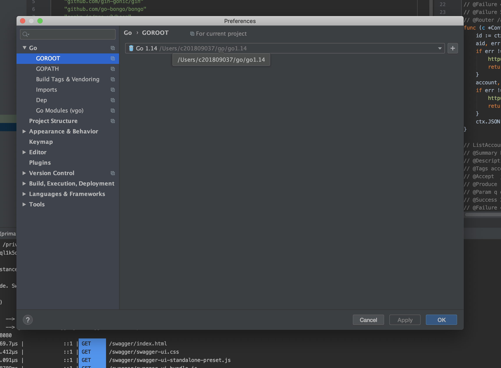
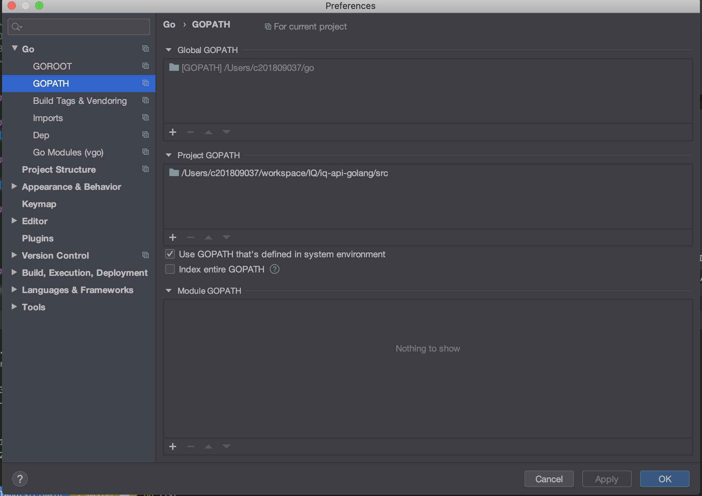

### QuickStart


#### 1. Docker Mongo Up
* ~/IQ/README.rst 읽고 .env 파일 생성
* ```docker-compose -f ./standalone.docker-compose.yml up -d  ``` 수행
* ``` docker ps ```  아래처럼 mongo 컨테이너가 올라가있어야한다.
~~~
CONTAINER ID   IMAGE     COMMAND                  CREATED             STATUS                          PORTS                                                                                        NAMES
f8bbb41e95b5   mongo     "docker-entrypoint.s…"   25 hours ago        Up 25 hours                     0.0.0.0:27017->27017/tcp                                                                     IQ_standalone_mongo
~~~


#### 2. GoLang goPath 등록

#### goRoot 설정


#### goPath 설정
* iq-api-golang/src 가 GOPATH가 되야한다.


### 3. install package
1. ```$ cd ~/src/main ```
2. ```go build ```  go.mod 파일이 있는 곳에서 수행해야함
3. ```go get -u github.com/swaggo/swag/cmd/swag ``` swaggo cmd build
4. ```swag init ``` swagger 문서 관련 파일 생성 ~/docs 이라는 패키지를 떨궈준다.  

### 4. Run Server
* ```go run main.go ```  참고: port와 host 선언은 main.go 에서 코드수정으로 작업한다. 


---


### [Reference] go module 
* go module을 사용 (go 패키지 관리 모듈이 다양했으나 go module 이라는 녀석으로 지금은  서열정리가 완벽히 끝났다.)
* go module은 pip requirement.txt처럼 go.mod는 필요한 라이브러리를 명시하는 파일
    * ```~./iq-api-golang/```이 project gopath 설정이 되있다면  ```~./iq-api-golang/src/pkg``` 폴더 하위에(venv처럼) 의존 패키지 설치함 
    * go get ~~ 명령어인듯한데 IDE GoLand는 go.mod있으면 알아서 설치해줌


#### [Reference] Gin Package Architecture (~~~clean architecture??~~~)
* [controller service repo golang 검색하니까 나온 내용 ](https://www.reddit.com/r/golang/comments/9h7dnn/repository_service_patern_go/)
* [(medium) Golang 표준 패키지 구조? ](https://medium.com/@benbjohnson/standard-package-layout-7cdbc8391fc1)
* 5분 구글링 검색결과이니 위에 두개는 100% 신뢰 ㄴㄴ
* [(go-gin tutorial Restfull) Projects API with Gin](https://riptutorial.com/go/example/29299/restfull-projects-api-with-gin)