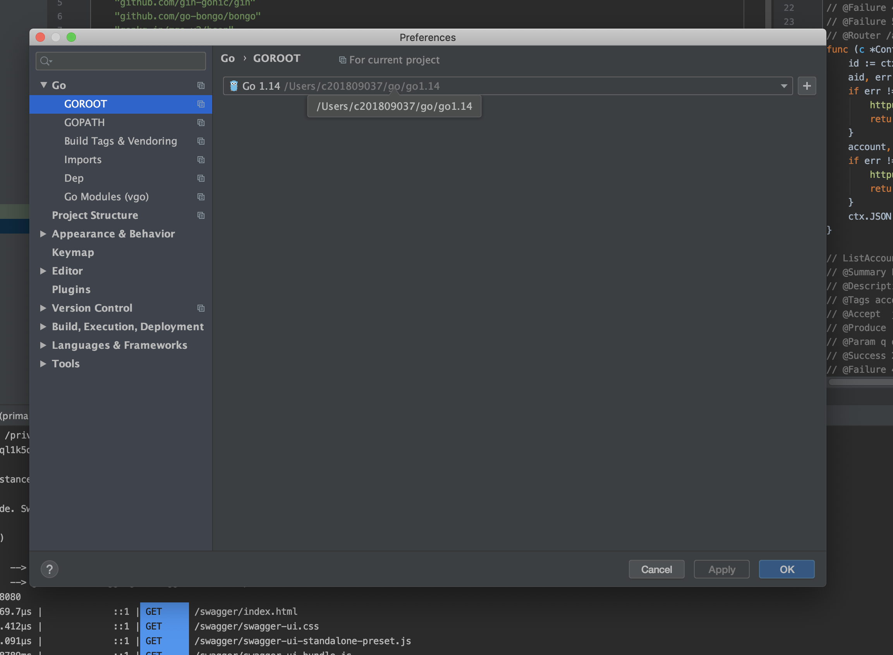
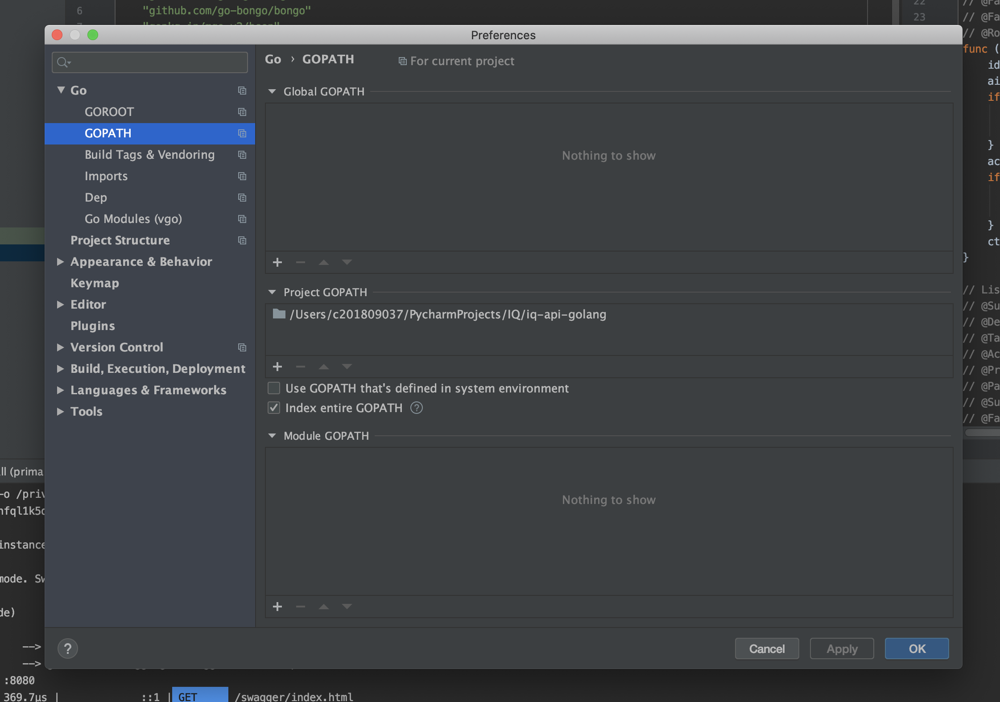

### QuickStart
Go는 문서화가 극악이다... 

#### 1. Docker Mongo .env 만들기
$ pwd 
~./iq-api-golang/

vi ./docker/.env
##### port는 취향, 토이 프로젝트가 메인포트 쓰는거 싫어서 포트번호 저렇게 설정함
~~~
MONGO_PORT=28817
MONGO_ROOT_USER=root
MONGO_ROOT_PASSWORD=root
MONGO_USER=user
MONGO_PASSWORD=user
~~~


#### 2. GoLang goPath 등록

#### goRoot 설정


#### goPath 설정
* go gin 프로젝트 ROOT경로가  GOPATH가 되야한다.


#### install package
* ``$ ./src go list -m -json all ```

* iq-api-golang 
    * docker (몽고 도커 .env 파일 생성필요 )
    * pkg (gopath 설정 제대로되면 iq-api-golang/pkg가 생성됨 go.mod파일을 읽어서 install함)
    * src (여기에 app단위(=package단위)로 소스코드 작성 )


### [정보] go 패키지 관리
* govendor라는 maven gradle 같은 툴이 있는데 원리공부어렵.. 
* 지금은 go module을 사용하기.. 여러 오픈소스 보면 vendor로 관리되는 것을 보면 나중에 결국 go vendor 써야할듯
* go module은 pip requirement.txt처럼 go.mod 파일에 필요한 라이브러리를 명시하는 파일
    * ```~./iq-api-golang/```이 project gopath 설정이 되있다면  ```~./iq-api-golang/pkg``` 폴더 하위에(venv처럼) 의존 패키지 설치함 
    * go get ~~ 명령어인듯한데 IDE GoLand는 go.mod있으면 알아서 설치해줌

#### Package 아키텍처는 아래 참고 
* [controller service repo 아키텍은 어케 쓰는지 모호 ](https://www.reddit.com/r/golang/comments/9h7dnn/repository_service_patern_go/)
  * 근데 gin example에 controller 있는거보면 Controller service 패턴을 쓰는거같긴한데...
* [Golang 표준 패키지 구조 medium](https://medium.com/@benbjohnson/standard-package-layout-7cdbc8391fc1)
* 5분 구글링 검색결과이니 위에 두문장은 100% 신뢰 ㄴㄴ
